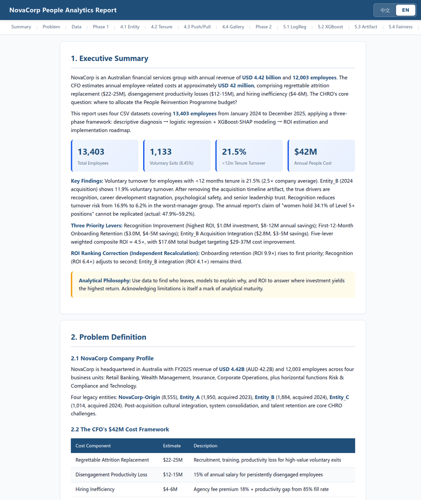

# NovaCorp People Analytics — Attrition Deep-Dive & Retention Playbook

A bilingual (EN / 中文) people-analytics case study: **who is leaving, why — and where should the retention budget actually go?**

**Live dashboard:** https://12345666ddwa.github.io/novacorp-people-analytics/

## The case

NovaCorp (a fictional $4.42B Australian financial group, 13,403 employees across four post-acquisition entities) sized its people-related cost at ~$42M/year — and asked where a limited "People Reinvention" budget would do the most good.

## What's inside

- **Stage 1 · Descriptive** — voluntary attrition 8.45%; the new-hire shock (under-12-month tenure: 21.5%, ~2.5× company average); post-acquisition Entity_B effect; push (preventable) vs pull (poached) analysis.
- **Stage 2 · Drivers** — logistic regression + XGBoost/SHAP with a lagged design; the "high-potential paradox" (HiPos leave more); recognition and senior-leadership trust as the strongest levers.
- **Stage 3 · ROI & playbook** — ranked interventions with costs, expected savings, an implementation roadmap, and an honest limitations section.

Five written reports in `docs/` (EN), the full chart set in `img/`, and the interactive dashboard (`dashboard.html`).

Team case-project deliverable — analysis, visualisation and bilingual report built for the people-analytics / datathon track.
